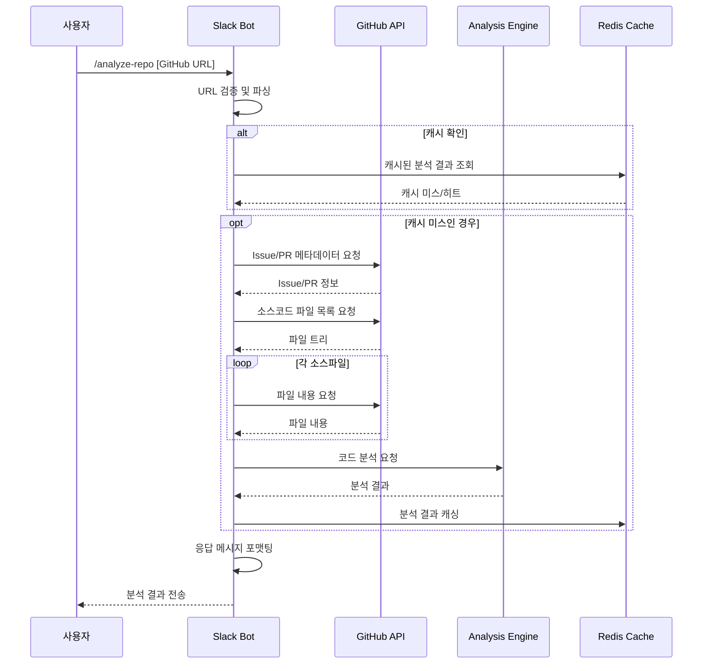
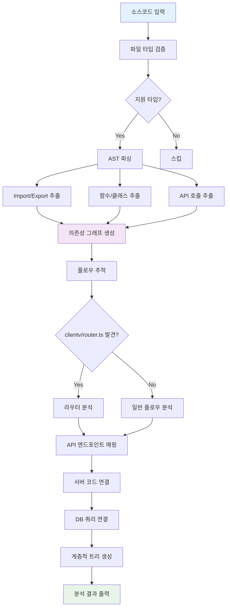
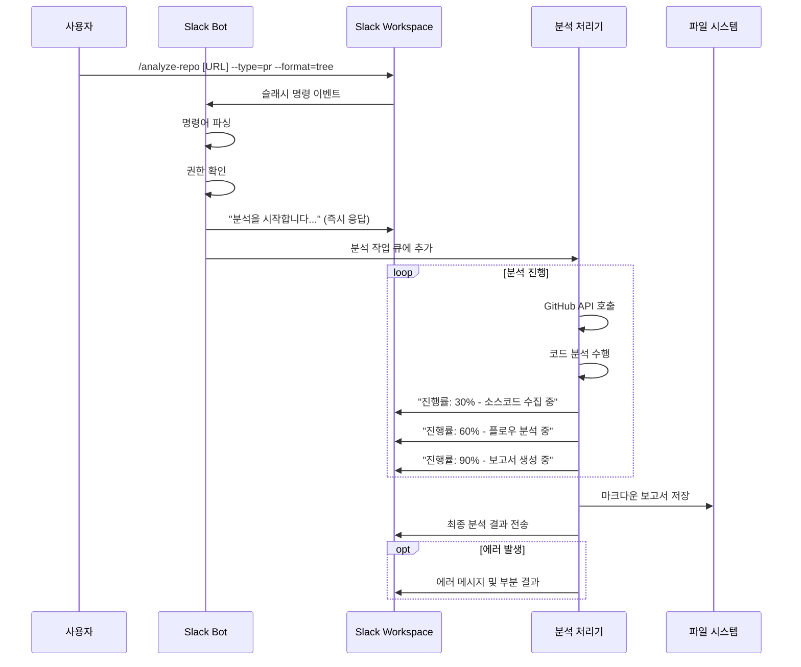
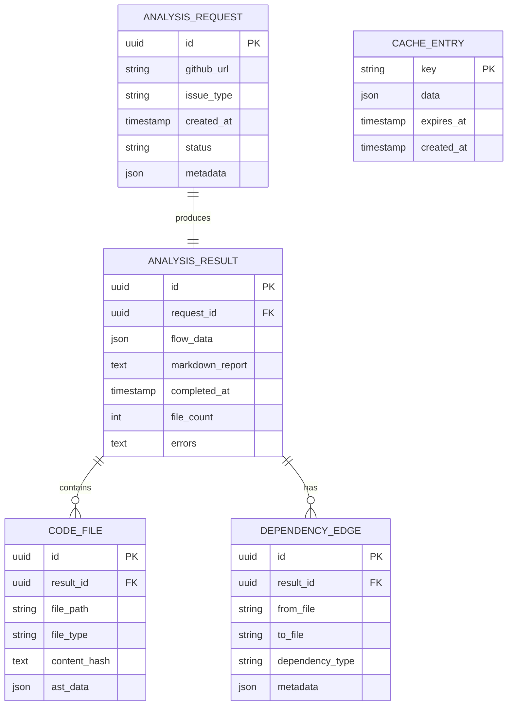
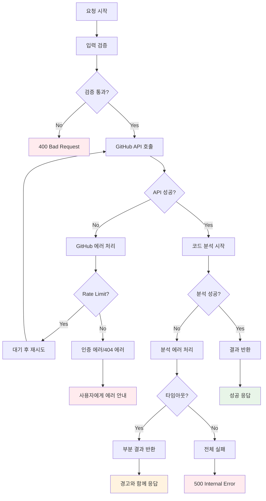
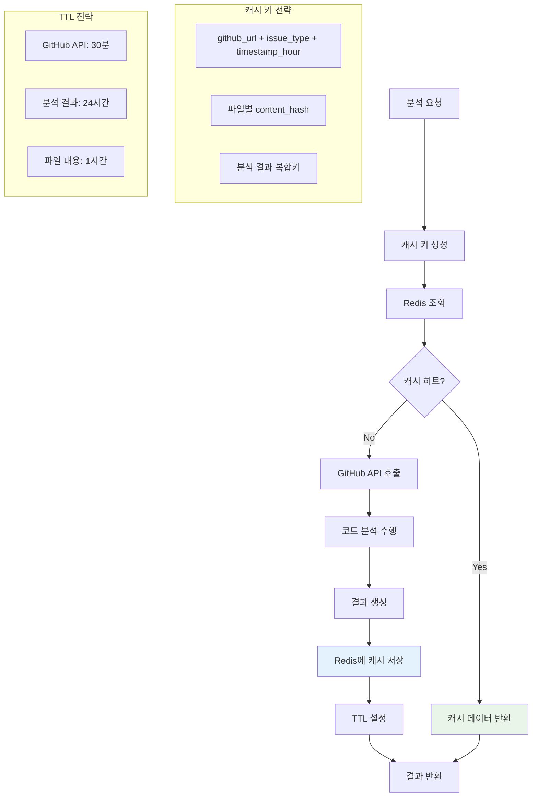

# 데이터 플로우 다이어그램

## 전체 시스템 플로우

```mermaid
flowchart TD
    A[개발자] --> B[Slack Bot]
    A --> C[Claude Code]

    B --> D[GitHub URL 분석 요청]
    C --> E[/analyze-github-url 명령]

    D --> F[GitHub API Client]
    E --> F

    F --> G[GitHub API]
    G --> H[Issue/PR 데이터]
    G --> I[소스코드 데이터]

    H --> J[Code Analysis Engine]
    I --> J

    J --> K[AST Parser]
    K --> L[Flow Tracker]
    L --> M[Dependency Analyzer]

    M --> N[분석 결과]
    N --> O[Report Generator]

    O --> P[마크다운 보고서]
    O --> Q[Slack 메시지]

    P --> R[파일 저장]
    Q --> S[Slack 채널 전송]

    C --> T[/export-to-slack 명령]
    R --> T
    T --> S

    style A fill:#e1f5fe
    style J fill:#f3e5f5
    style O fill:#e8f5e8
```

## GitHub 연동 플로우



## 코드 분석 엔진 플로우



## Slack Bot 인터랙션 플로우



## Claude Code 명령어 플로우

```mermaid
flowchart TD
    A[개발자] --> B[Claude Code IDE]
    B --> C[/analyze-github-url 실행]

    C --> D[GitHub URL 입력]
    D --> E[GitHub API 연동]
    E --> F[소스코드 분석]

    F --> G[분석 보고서 생성]
    G --> H[타임스탬프 포함 MD 파일]

    H --> I[로컬 저장]
    I --> J[/export-to-slack 실행]

    J --> K[보고서 파일 선택]
    K --> L[Slack 포맷 변환]
    L --> M[Slack 채널 전송]

    style A fill:#e1f5fe
    style F fill:#f3e5f5
    style M fill:#e8f5e8
```

## 데이터 저장 플로우



## 에러 처리 플로우



## 캐싱 전략 플로우

