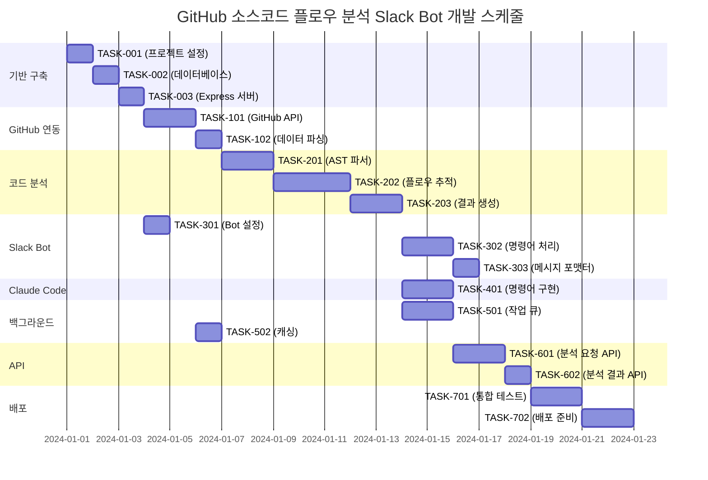

# GitHub 소스코드 플로우 분석 Slack Bot 구현 태스크

## 개요

전체 태스크 수: 24개
추정 작업 시간: 18-22일 (3-4주)
크리티컬 패스: TASK-001 → TASK-002 → TASK-101 → TASK-201 → TASK-301 → TASK-401

## 태스크 목록

### 페이즈 1: 기반 구축

#### TASK-001: 프로젝트 기반 설정

- [x] **태스크 완료**
- **태스크 타입**: DIRECT
- **요구사항 링크**: REQ-401, REQ-403, REQ-404
- **의존 태스크**: 없음
- **구현 상세**:
  - Node.js/TypeScript 프로젝트 초기화
  - package.json 및 의존성 설정
  - TypeScript 설정 (tsconfig.json)
  - ESLint/Prettier 설정
  - 환경 변수 템플릿 (.env.example)
  - Docker 설정 (Dockerfile, docker-compose.yml)
- **테스트 요구사항**:
  - [ ] 프로젝트 빌드 테스트
  - [ ] 린팅 및 포맷팅 검증
  - [ ] Docker 컨테이너 빌드 테스트
- **완료 조건**:
  - [ ] npm run build 성공
  - [ ] npm run lint 오류 없음
  - [ ] Docker 컨테이너 실행 가능

#### TASK-002: 데이터베이스 초기 설정

- [x] **태스크 완료**
- **태스크 타입**: DIRECT
- **요구사항 링크**: REQ-401, NFR-313
- **의존 태스크**: TASK-001
- **구현 상세**:
  - PostgreSQL Docker 컨테이너 설정
  - 데이터베이스 스키마 생성 (database-schema.sql 적용)
  - 연결 풀 설정 (pg)
  - 마이그레이션 도구 설정 (선택사항)
  - Redis 캐시 설정
- **테스트 요구사항**:
  - [ ] 데이터베이스 연결 테스트
  - [ ] 스키마 검증 테스트
  - [ ] Redis 연결 테스트
- **완료 조건**:
  - [ ] 데이터베이스가 정상 기동
  - [ ] 모든 테이블 및 인덱스 생성 완료
  - [ ] Redis 캐시 연결 가능

#### TASK-003: Express.js 서버 기본 설정

- [x] **태스크 완료**
- **태스크 타입**: DIRECT
- **요구사항 링크**: REQ-001, REQ-005
- **의존 태스크**: TASK-002
- **구현 상세**:
  - Express.js 애플리케이션 설정
  - 미들웨어 설정 (CORS, helmet, morgan)
  - 기본 라우터 구조 생성
  - 에러 핸들링 미들웨어
  - 헬스체크 엔드포인트
- **테스트 요구사항**:
  - [ ] 서버 기동 테스트
  - [ ] 헬스체크 엔드포인트 테스트
  - [ ] 기본 미들웨어 동작 테스트
- **완료 조건**:
  - [ ] 서버가 정상 기동 (포트 3000)
  - [ ] GET /health 응답 성공
  - [ ] 기본 CORS 설정 동작

### 페이즈 2: GitHub API 연동

#### TASK-101: GitHub API 클라이언트 구현

- [ ] **태스크 완료**
- **태스크 타입**: TDD
- **요구사항 링크**: REQ-001, REQ-101, REQ-105
- **의존 태스크**: TASK-003
- **구현 상세**:
  - Octokit.js 클라이언트 래퍼 구현
  - GitHub API 인증 처리
  - Rate Limiting 대응 메커니즘
  - Issue/PR 메타데이터 수집
  - 소스코드 파일 수집
- **테스트 요구사항**:
  - [ ] 단위 테스트: GitHub API 클라이언트 메서드
  - [ ] 통합 테스트: 실제 GitHub API 호출 (Mock)
  - [ ] Rate Limiting 테스트
- **오류 핸들링**:
  - [ ] GitHub API 인증 실패
  - [ ] Rate Limit 초과
  - [ ] 네트워크 오류
  - [ ] 존재하지 않는 레포지토리/Issue

#### TASK-102: GitHub 데이터 파싱 구현

- [ ] **태스크 완료**
- **태스크 타입**: TDD
- **요구사항 링크**: REQ-002, REQ-102, REQ-103
- **의존 태스크**: TASK-101
- **구현 상세**:
  - GitHub URL 파싱 및 검증
  - Issue/PR 타입 자동 감지
  - 파일 필터링 (크기, 확장자)
  - 메타데이터 추출 및 정규화
- **테스트 요구사항**:
  - [ ] 단위 테스트: URL 파싱 로직
  - [ ] 단위 테스트: 타입 감지 로직
  - [ ] 경계값 테스트: 파일 크기 제한
- **검증 요구사항**:
  - [ ] 다양한 GitHub URL 형식 지원
  - [ ] Issue와 PR 타입 정확한 구분
  - [ ] 대용량 파일 자동 제외

### 페이즈 3: 코드 분석 엔진

#### TASK-201: AST 파서 구현

- [ ] **태스크 완료**
- **태스크 타입**: TDD
- **요구사항 링크**: REQ-404, REQ-002
- **의존 태스크**: TASK-102
- **구현 상세**:
  - TypeScript Compiler API 활용
  - 소스코드 AST 생성
  - Import/Export 문 추출
  - 함수/클래스 정의 추출
  - API 호출 패턴 감지
- **테스트 요구사항**:
  - [ ] 단위 테스트: AST 파싱 로직
  - [ ] 통합 테스트: 다양한 소스코드 패턴
  - [ ] 성능 테스트: 대용량 파일 처리
- **오류 핸들링**:
  - [ ] 문법 오류가 있는 소스코드
  - [ ] 지원하지 않는 파일 타입
  - [ ] 메모리 부족

#### TASK-202: 플로우 추적 엔진 구현

- [ ] **태스크 완료**
- **태스크 타입**: TDD
- **요구사항 링크**: REQ-002, REQ-003, REQ-004
- **의존 태스크**: TASK-201
- **구현 상세**:
  - clientv/router.ts 진입점 탐지
  - API 엔드포인트 → 서버 코드 매핑
  - 의존성 그래프 생성
  - 순환 의존성 감지
  - 플로우 깊이 제한
- **테스트 요구사항**:
  - [ ] 단위 테스트: 플로우 추적 알고리즘
  - [ ] 통합 테스트: 전체 플로우 생성
  - [ ] 엣지 케이스: 순환 의존성 처리
- **검증 요구사항**:
  - [ ] Client → API → Server → DB 플로우 추적
  - [ ] 계층적 트리 구조 생성
  - [ ] 최대 깊이 제한 (무한 루프 방지)

#### TASK-203: 분석 결과 생성기 구현

- [ ] **태스크 완료**
- **태스크 타입**: TDD
- **요구사항 링크**: REQ-004, REQ-006, REQ-009
- **의존 태스크**: TASK-202
- **구현 상세**:
  - 계층적 트리 구조 포맷팅
  - 마크다운 보고서 생성
  - Mermaid 다이어그램 생성 (선택)
  - 잠재적 이슈 감지 및 보고
  - 타임스탬프 포함 파일명 생성
- **테스트 요구사항**:
  - [ ] 단위 테스트: 보고서 포맷팅
  - [ ] 통합 테스트: 전체 보고서 생성
  - [ ] 템플릿 테스트: 마크다운 구조 검증
- **UI/UX 요구사항**:
  - [ ] 가독성 높은 트리 구조
  - [ ] 색상 코딩 (파일 타입별)
  - [ ] 클릭 가능한 파일 링크

### 페이즈 4: Slack Bot 통합

#### TASK-301: Slack Bot 기본 설정

- [ ] **태스크 완료**
- **태스크 타입**: DIRECT
- **요구사항 링크**: REQ-005, REQ-402, NFR-311, NFR-312
- **의존 태스크**: TASK-003
- **구현 상세**:
  - Slack Bolt Framework 설정
  - Slack App 인증 및 권한 설정
  - 워크스페이스 허용 목록 관리
  - 기본 이벤트 핸들러 설정
- **테스트 요구사항**:
  - [ ] Slack 연결 테스트
  - [ ] 인증 토큰 검증
  - [ ] 워크스페이스 권한 테스트
- **완료 조건**:
  - [ ] Slack App이 정상 연결
  - [ ] 허용된 워크스페이스에서만 동작
  - [ ] 기본 핑-퐁 응답 동작

#### TASK-302: Slack 명령어 처리기 구현

- [ ] **태스크 완료**
- **태스크 타입**: TDD
- **요구사항 링크**: REQ-005, REQ-101, REQ-102
- **의존 태스크**: TASK-301, TASK-203
- **구현 상세**:
  - /analyze-repo 슬래시 명령어 파싱
  - 명령어 옵션 처리 (--type, --depth, --format)
  - 입력 검증 및 에러 응답
  - 분석 요청 큐 생성
- **테스트 요구사항**:
  - [ ] 단위 테스트: 명령어 파싱 로직
  - [ ] 통합 테스트: Slack 명령어 처리 플로우
  - [ ] 검증 테스트: 잘못된 입력 처리
- **UI/UX 요구사항**:
  - [ ] 즉시 응답: "분석을 시작합니다" 메시지
  - [ ] 도움말 기능: /analyze-repo help
  - [ ] 사용자 친화적 에러 메시지

#### TASK-303: Slack 메시지 포맷터 구현

- [ ] **태스크 완료**
- **태스크 타입**: TDD
- **요구사항 링크**: REQ-005, NFR-202, NFR-203
- **의존 태스크**: TASK-302
- **구현 상세**:
  - 분석 결과 Slack 블록 포맷팅
  - 진행률 업데이트 메시지
  - 에러 및 경고 메시지 포맷팅
  - 인터랙티브 버튼 (취소, 재시도)
- **테스트 요구사항**:
  - [ ] 단위 테스트: 메시지 블록 생성
  - [ ] 통합 테스트: 실제 Slack 메시지 전송
  - [ ] UI 테스트: 메시지 레이아웃 검증
- **UI/UX 요구사항**:
  - [ ] 시각적 구분: 성공/에러/경고 색상
  - [ ] 진행률 표시: 퍼센트 + 단계 설명
  - [ ] 결과 요약: 파일 수, 이슈 수 등

### 페이즈 5: Claude Code 통합

#### TASK-401: Claude Code 명령어 구현

- [ ] **태스크 완료**
- **태스크 타입**: TDD
- **요구사항 링크**: REQ-007, REQ-008, REQ-009, REQ-405
- **의존 태스크**: TASK-203
- **구현 상세**:
  - /analyze-github-url 명령어 처리
  - /export-to-slack 명령어 처리
  - Claude Code Command 표준 형식 준수
  - .commands/ 디렉토리 구조 생성
- **테스트 요구사항**:
  - [ ] 단위 테스트: 명령어 처리 로직
  - [ ] 통합 테스트: 파일 생성 및 전송
  - [ ] 표준 준수 테스트: 문서 형식 검증
- **완료 조건**:
  - [ ] 두 명령어가 정상 동작
  - [ ] 표준 형식에 맞는 파일 생성
  - [ ] 목적, 전제조건, 실행내용, 출력포맷 포함

### 페이즈 6: 백그라운드 작업 처리

#### TASK-501: 분석 작업 큐 시스템 구현

- [ ] **태스크 완료**
- **태스크 타입**: TDD
- **요구사항 링크**: REQ-106, NFR-001, NFR-004
- **의존 태스크**: TASK-002, TASK-203
- **구현 상세**:
  - Bull Queue + Redis 설정
  - 분석 작업 큐 생성 및 처리
  - 진행률 추적 및 업데이트
  - 시간 초과 처리 (5분 제한)
  - 동시 처리 제한 (5개)
- **테스트 요구사항**:
  - [ ] 단위 테스트: 큐 작업 처리
  - [ ] 성능 테스트: 동시 작업 처리
  - [ ] 타임아웃 테스트: 시간 초과 처리
- **오류 핸들링**:
  - [ ] 작업 실패 시 재시도
  - [ ] 시간 초과 시 부분 결과 반환
  - [ ] 큐 오버플로우 처리

#### TASK-502: 캐싱 시스템 구현

- [ ] **태스크 완료**
- **태스크 타입**: TDD
- **요구사항 링크**: REQ-105, NFR-002
- **의존 태스크**: TASK-002, TASK-101
- **구현 상세**:
  - Redis 기반 캐싱 레이어
  - GitHub API 응답 캐싱 (30분 TTL)
  - 분석 결과 캐싱 (24시간 TTL)
  - 캐시 키 전략 구현
  - 자동 만료 정리
- **테스트 요구사항**:
  - [ ] 단위 테스트: 캐시 읽기/쓰기
  - [ ] 통합 테스트: TTL 만료 동작
  - [ ] 성능 테스트: 캐시 히트율
- **검증 요구사항**:
  - [ ] 캐시 히트 시 응답 시간 단축
  - [ ] 메모리 사용량 제한
  - [ ] 자동 만료 동작

### 페이즈 7: API 엔드포인트 구현

#### TASK-601: 분석 요청 API 구현

- [ ] **태스크 완료**
- **태스크 타입**: TDD
- **요구사항 링크**: API 사양서 참조
- **의존 태스크**: TASK-501
- **구현 상세**:
  - POST /analysis/requests 구현
  - GET /analysis/requests/{id} 구현
  - GET /analysis/requests 목록 조회
  - DELETE /analysis/requests/{id} 취소
- **테스트 요구사항**:
  - [ ] 단위 테스트: API 라우터
  - [ ] 통합 테스트: 전체 API 플로우
  - [ ] 검증 테스트: 입력 유효성 검사
- **오류 핸들링**:
  - [ ] 잘못된 GitHub URL
  - [ ] 권한 없는 요청
  - [ ] Rate Limit 초과

#### TASK-602: 분석 결과 API 구현

- [ ] **태스크 완료**
- **태스크 타입**: TDD
- **요구사항 링크**: API 사양서 참조
- **의존 태스크**: TASK-601
- **구현 상세**:
  - GET /analysis/results/{request_id} 구현
  - GET /analysis/results/{request_id}/download 구현
  - GET /analysis/requests/{id}/errors 구현
  - GET /analysis/requests/{id}/warnings 구현
- **테스트 요구사항**:
  - [ ] 단위 테스트: 결과 조회 로직
  - [ ] 통합 테스트: 파일 다운로드
  - [ ] 권한 테스트: 결과 접근 제어

### 페이즈 8: 통합 및 배포

#### TASK-701: 통합 테스트 스위트 구현

- [ ] **태스크 완료**
- **태스크 타입**: TDD
- **요구사항 링크**: 모든 요구사항
- **의존 태스크**: TASK-602, TASK-401
- **구현 상세**:
  - Jest + Supertest 통합 테스트
  - 전체 분석 플로우 E2E 테스트
  - Slack Bot 통합 테스트
  - Claude Code 명령어 테스트
- **테스트 요구사항**:
  - [ ] E2E 테스트: GitHub → 분석 → Slack 전송
  - [ ] E2E 테스트: Claude Code 명령어
  - [ ] 성능 테스트: 응답 시간 검증
- **완료 조건**:
  - [ ] 모든 E2E 테스트 통과
  - [ ] 성능 요구사항 만족
  - [ ] 에러 시나리오 커버

#### TASK-702: 배포 준비 및 설정

- [ ] **태스크 완료**
- **태스크 타입**: DIRECT
- **요구사항 링크**: NFR-321, NFR-322, NFR-323
- **의존 태스크**: TASK-701
- **구현 상세**:
  - AWS Lambda 배포 설정
  - Docker 이미지 최적화
  - 환경별 설정 파일 (dev, staging, prod)
  - CI/CD 파이프라인 설정 (GitHub Actions)
  - 모니터링 및 로깅 설정
- **테스트 요구사항**:
  - [ ] 배포 스크립트 테스트
  - [ ] Docker 빌드 및 실행 테스트
  - [ ] 환경 변수 검증
- **완료 조건**:
  - [ ] 모든 배포 환경에서 정상 동작
  - [ ] 모니터링 대시보드 설정 완료
  - [ ] 자동 배포 파이프라인 동작

## 실행 순서

## 마일스톤

### 🎯 마일스톤 1: 기반 완성 (3일)
- TASK-001, TASK-002, TASK-003 완료
- 기본 서버 및 데이터베이스 동작 확인

### 🎯 마일스톤 2: 코어 기능 완성 (8일)
- TASK-101 ~ TASK-203 완료
- GitHub → 분석 → 보고서 생성 파이프라인 완성

### 🎯 마일스톤 3: Slack 통합 완성 (11일)
- TASK-301 ~ TASK-303 완료
- Slack Bot 기본 동작 확인

### 🎯 마일스톤 4: 전체 기능 완성 (16일)
- TASK-401, TASK-501, TASK-502 완료
- 모든 핵심 기능 통합 완료

### 🎯 마일스톤 5: 배포 준비 완성 (18-22일)
- TASK-601 ~ TASK-702 완료
- 프로덕션 배포 가능 상태

## 크리티컬 패스

**핵심 경로**: TASK-001 → TASK-002 → TASK-003 → TASK-101 → TASK-102 → TASK-201 → TASK-202 → TASK-203 → TASK-302 → TASK-701 → TASK-702

이 경로의 지연은 전체 프로젝트 일정에 직접 영향을 미칩니다.

## 병렬 실행 가능 그룹

### 그룹 A (기반 구축 후):
- TASK-301 (Slack Bot 설정)
- TASK-502 (캐싱 시스템)

### 그룹 B (코어 완성 후):
- TASK-401 (Claude Code)
- TASK-501 (작업 큐)

### 그룹 C (백엔드 완성 후):
- TASK-601 (분석 요청 API)
- TASK-303 (메시지 포맷터)

## 서브태스크 템플릿

### TDD 태스크의 경우

각 TDD 태스크는 다음 프로세스로 구현:

1. `tdd-requirements.md` - 상세 요구사항 정의
2. `tdd-testcases.md` - 테스트 케이스 작성
3. `tdd-red.md` - 테스트 구현(실패)
4. `tdd-green.md` - 최소 구현
5. `tdd-refactor.md` - 리팩토링
6. `tdd-verify-complete.md` - 품질 확인

### DIRECT 태스크의 경우

각 DIRECT 태스크는 다음 프로세스로 구현:

1. `direct-setup.md` - 직접 구현·설정
2. `direct-verify.md` - 동작 확인·품질 확인