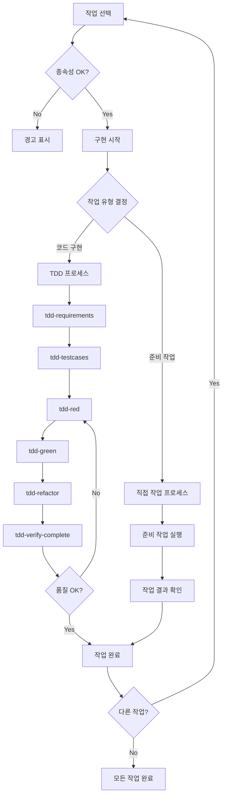

# kairo-implement

## 목적
분할된 작업을 순서대로 또는 사용자가 지정한 작업을 구현합니다. 기존 TDD 명령어를 활용하여 고품질 구현을 수행합니다.

## 전제 조건
- `docs/tasks/{요구사항명}-tasks.md`에 작업 목록이 존재해야 함
- 사용자가 작업 구현을 승인했어야 함
- 기존 TDD 명령어를 사용할 수 있어야 함
- 구현을 위한 작업 공간이 설정되어 있어야 함

## 실행 내용

1. **작업 선택**
   - 사용자가 지정한 작업 ID 확인
   - 지정되지 않은 경우, 종속성을 기반으로 다음 작업 자동 선택
   - 선택한 작업의 상세 내용 표시

2. **종속성 확인**
   - 종속 작업이 완료되었는지 확인
   - 미완료된 종속 작업이 있는 경우 경고

3. **구현 디렉토리 준비**
   - 현재 작업 공간에서 작업 수행
   - 필요한 경우 디렉토리 구조 확인

4. **구현 유형 결정**
   - 작업의 성격 분석 (코드 구현 vs 준비 작업)
   - 구현 방식 결정 (TDD vs 직접 작업)

5. **구현 프로세스 실행**

   ### A. **TDD 프로세스** (코드 구현 작업용)

   a. **요구사항 정의** (`tdd-requirements.md`)
   - 작업의 상세 요구사항 작성
   - 수용 기준 명확화

   b. **테스트 케이스 작성** (`tdd-testcases.md`)
   - 단위 테스트 케이스 작성
   - 경계 케이스 고려

   c. **테스트 구현** (`tdd-red.md`)
   - 실패하는 테스트 구현
   - 테스트가 실패하는지 확인

   d. **최소 구현** (`tdd-green.md`)
   - 테스트가 통과하는 최소한의 구현
   - 과도한 구현 회피

   e. **리팩토링** (`tdd-refactor.md`)
   - 코드 품질 향상
   - 유지보수성 개선

   f. **품질 확인** (`tdd-verify-complete.md`)
   - 구현 완성도 확인
   - 부족한 부분이 있으면 c-f 반복

   ### B. **직접 작업 프로세스** (준비 작업용)

   a. **준비 작업 실행**
   - 디렉토리 생성
   - 설정 파일 생성
   - 의존성 설치
   - 환경 설정

   b. **작업 결과 확인**
   - 작업 완료 검증
   - 예상된 산출물 확인
   - 다음 작업을 위한 준비 상태 확인

6. **작업 완료 처리**
   - 작업 상태 업데이트 (작업 파일의 체크박스 체크)
   - 구현 결과 문서화
   - 다음 작업 제안

## 실행 흐름



## 명령어 실행 예시

```bash
# 모든 작업을 순서대로 구현
$ claude code kairo-implement --all

# 특정 작업 구현
$ claude code kairo-implement --task TASK-101

# 병렬 실행 가능한 작업 목록 표시
$ claude code kairo-implement --list-parallel

# 현재 진행 상황 표시
$ claude code kairo-implement --status
```

## 구현 유형 결정 기준

### TDD 프로세스 (코드 구현 작업)

다음 조건에 해당하는 작업:

- 새로운 컴포넌트, 서비스, 훅 등의 구현
- 기존 코드의 기능 추가/수정
- 비즈니스 로직 구현
- API 구현

**예**: TaskService 구현, UI 컴포넌트 생성, 상태 관리 구현

### 직접 작업 프로세스 (준비 작업)

다음 조건에 해당하는 작업:

- 프로젝트 초기화/환경 구축
- 디렉토리 구조 생성
- 설정 파일 생성/업데이트
- 의존성 설치
- 도구 설정/구성

**예**: 프로젝트 초기화, 데이터베이스 설정, 개발 환경 설정

## 구현 시 주의사항

### TDD 프로세스용

1. **테스트 우선**
   - 반드시 테스트를 먼저 작성
   - 테스트가 실패하는지 확인한 후 구현

2. **점진적 구현**
   - 한 번에 모두 구현하지 않음
   - 작은 단계로 진행

3. **지속적인 품질 확인**
   - 각 단계에서 품질 확인
   - 기술 부채를 만들지 않기

### 직접 작업 프로세스용

1. **단계적 작업 실행**
   - 종속성을 고려한 순서로 실행
   - 각 단계의 완료 확인

2. **설정 검증**
   - 생성한 설정 파일의 동작 확인
   - 환경 정상성 점검

3. **문서 업데이트**
   - 구현과 동시에 문서도 업데이트
   - 다른 개발자가 이해할 수 있도록

## 출력 형식

### 작업 시작 시 (TDD 프로세스)

```
🚀 작업 TASK-101: 사용자 인증 API 구현을 시작합니다

📋 작업 상세:
- 요구사항: REQ-101, REQ-102
- 종속성: TASK-002 ✅
- 예상 시간: 4시간
- 구현 유형: TDD 프로세스

🔄 TDD 프로세스를 시작합니다...
```

### 작업 시작 시 (직접 작업 프로세스)

```
🚀 작업 TASK-003: 데이터베이스 설정 작업을 시작합니다

📋 작업 상세:
- 요구사항: REQ-402, REQ-006
- 종속성: TASK-001 ✅
- 예상 시간: 1시간
- 구현 유형: 직접 작업 프로세스

🔧 직접 작업 프로세스를 시작합니다...
```

### 작업 완료 시

```
✅ 작업 TASK-101: 사용자 인증 API 구현을 완료했습니다

📊 작업 결과:
- 구현 파일: src/services/AuthService.ts
- 테스트 파일: tests/unit/AuthService.test.ts
- 문서: docs/api/auth.md

➡️ 다음 작업: TASK-105: 프론트엔드 인증 컴포넌트 구현
```

## 문제 해결

### 일반적인 문제

1. **의존성 문제**
   - 해결책: `npm ls` 또는 `yarn why`로 의존성 확인

2. **테스트 실패**
   - 해결책: 테스트 로그를 자세히 확인하고, 실패 원인 분석

3. **환경 문제**
   - 해결책: `.env` 파일과 환경 변수 확인

### 디버깅 팁

1. **로깅 활용**
   - 중요한 단계마다 로그 추가
   - 디버그 모드 활성화

2. **단계별 확인**
   - 작은 단위로 나누어 테스트
   - 각 단계의 출력 확인

3. **문서 참조**
   - API 문서 확인
   - 이슈 트래커 검색

## 모범 사례

### 코드 품질
- 일관된 코딩 스타일 유지
- 의미 있는 커밋 메시지 작성
- 주석은 왜(Why)를 설명

### 테스트
- 테스트 커버리지 목표 설정
- 테스트는 독립적으로 실행 가능해야 함
- 모의 객체(Mock)를 적절히 활용

### 문서화
- 공개 API는 반드시 문서화
- 설정 변경 사항은 즉시 문서 반영
- 예제 코드 제공
