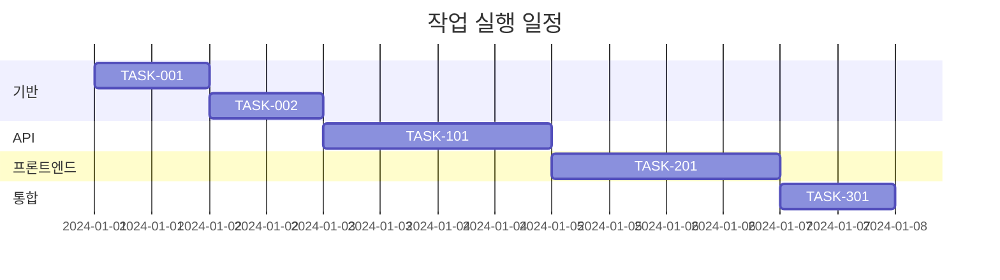

# kairo-tasks

## 목적
설계 문서를 기반으로 구현 작업을 분할하고, 의존성을 고려한 적절한 순서로 정리합니다. 각 작업에는 구현 상세, 테스트 요구사항, UI/UX 요구사항이 포함됩니다.

## 전제 조건
- `docs/design/{요구사항명}/`에 설계 문서가 존재해야 함
- 설계가 사용자에 의해 승인되었거나 (또는 승인이 생략됨)
- `docs/tasks/` 디렉토리가 존재해야 함 (없는 경우 생성)

## 실행 내용

1. **설계 문서 분석**
   - `docs/design/{요구사항명}/architecture.md` 확인
   - `docs/design/{요구사항명}/database-schema.sql` 확인
   - `docs/design/{요구사항명}/api-endpoints.md` 확인
   - `docs/design/{요구사항명}/interfaces.ts` 확인
   - `docs/design/{요구사항명}/dataflow.md` 확인

2. **작업 식별**
   - 기반 작업 (DB 설정, 환경 구축 등)
   - 백엔드 작업 (API 구현)
   - 프론트엔드 작업 (UI 구현)
   - 통합 작업 (E2E 테스트 등)

3. **의존성 분석**
   - 작업 간 의존성 명확화
   - 병렬 실행 가능한 작업 식별
   - 임계 경로 파악

4. **작업 상세화**
   각 작업에 다음을 포함:
   - 작업 ID (고유 식별자)
   - 작업명
   - 작업 유형 (TDD/직접)
     - **TDD**: 코딩, 비즈니스 로직 구현, UI 구현, 테스트 구현 등 개발 작업
     - **직접**: 환경 구축, 설정 파일 생성, 문서화, 빌드 설정 등 준비 작업
   - 요구사항 링크
   - 종속 작업
   - 구현 상세
   - 단위 테스트 요구사항
   - 통합 테스트 요구사항
   - UI/UX 요구사항 (해당하는 경우)
     - 로딩 상태
     - 오류 표시
     - 모바일 대응
     - 접근성 요구사항

5. **작업 순서 지정**
   - 의존성에 따라 실행 순서 결정
   - 마일스톤 설정
   - 병렬 실행 가능한 작업 그룹화

6. **파일 생성**
   - `docs/tasks/{요구사항명}-tasks.md`로 저장
   - 출력 형식 예시를 확인하고, 예시에 맞는 정보를 기재
   - 각 작업에 체크박스를 추가하여 완료 상태를 추적할 수 있도록 함
   - 출력 형식 예시를 확인하여 누락된 정보가 있으면 추가

## 출력 형식 예시

````markdown
# {요구사항명} 구현 작업

## 개요

전체 작업 수: {숫자}
예상 작업 시간: {시간}
임계 경로: {작업 ID 목록}

## 작업 목록

### 1단계: 기반 구축

#### TASK-001: 데이터베이스 초기 설정

- [ ] **작업 완료**
- **작업 유형**: 직접
- **요구사항 링크**: REQ-401
- **종속 작업**: 없음
- **구현 상세**:
  - PostgreSQL Docker 컨테이너 설정
  - 초기 스키마 생성
  - 마이그레이션 설정
- **테스트 요구사항**:
  - [ ] 데이터베이스 연결 테스트
  - [ ] 스키마 검증 테스트
- **완료 조건**:
  - [ ] 데이터베이스가 실행 중
  - [ ] 모든 테이블이 생성됨

#### TASK-002: 백엔드 기본 설정

- [ ] **작업 완료**
- **작업 유형**: 직접
- **요구사항 링크**: REQ-001, REQ-002
- **종속 작업**: TASK-001
- **구현 상세**:
  - Express/NestJS 초기 설정
  - TypeScript 설정
  - 환경 변수 설정
- **테스트 요구사항**:
  - [ ] 서버 시작 테스트
  - [ ] 헬스 체크 엔드포인트 테스트

### 2단계: API 구현

#### TASK-101: 사용자 인증 API

- [ ] **작업 완료**
- **작업 유형**: TDD
- **요구사항 링크**: REQ-101, REQ-102
- **종속 작업**: TASK-002
- **구현 상세**:
  - JWT 인증 구현
  - 로그인/로그아웃 엔드포인트
  - 토큰 갱신 기능
- **테스트 요구사항**:
  - [ ] 단위 테스트: 인증 로직
  - [ ] 통합 테스트: 로그인 플로우
  - [ ] 보안 테스트: 토큰 검증
- **오류 처리**:
  - [ ] 잘못된 인증 정보
  - [ ] 토큰 만료
  - [ ] 요청 제한

### 3단계: 프론트엔드 구현

#### TASK-201: 로그인 화면

- [ ] **작업 완료**
- **작업 유형**: TDD
- **요구사항 링크**: REQ-101
- **종속 작업**: TASK-101
- **구현 상세**:
  - React/Vue/Angular 컴포넌트
  - 폼 유효성 검사
  - 오류 표시
- **UI/UX 요구사항**:
  - [ ] 로딩 상태: 버튼 비활성화 + 스피너
  - [ ] 오류 표시: 토스트 알림
  - [ ] 모바일 대응: 반응형 디자인
  - [ ] 접근성: ARIA 속성, 키보드 조작
- **테스트 요구사항**:
  - [ ] 컴포넌트 테스트
  - [ ] E2E 테스트: 로그인 플로우
  - [ ] 반응형 테스트

### 4단계: 통합 및 최적화

#### TASK-301: E2E 테스트 스위트

- [ ] **작업 완료**
- **작업 유형**: TDD
- **요구사항 링크**: 모든 요구사항
- **종속 작업**: TASK-201
- **구현 상세**:
  - Cypress/Playwright 설정
  - 주요 사용자 플로우 테스트
  - CI/CD 통합

## 실행 순서


````

## 하위 작업 템플릿

### TDD 작업의 경우

각 작업은 다음 TDD 프로세스로 구현:

1. `tdd-requirements.md` - 상세 요구사항 정의
2. `tdd-testcases.md` - 테스트 케이스 작성
3. `tdd-red.md` - 테스트 구현 (실패)
4. `tdd-green.md` - 최소 구현
5. `tdd-refactor.md` - 리팩토링
6. `tdd-verify-complete.md` - 품질 확인

### 직접 작업의 경우

각 작업은 다음 DIRECT 프로세스로 구현:

1. `direct-setup.md` - 직접 구현/설정
2. `direct-verify.md` - 동작 확인/품질 확인

## 실행 후 확인

- 생성된 파일 경로 표시
- 식별된 주요 작업 수 보고
- 총 예상 작업 시간 표시
- 사용자 확인을 위한 메시지 표시
