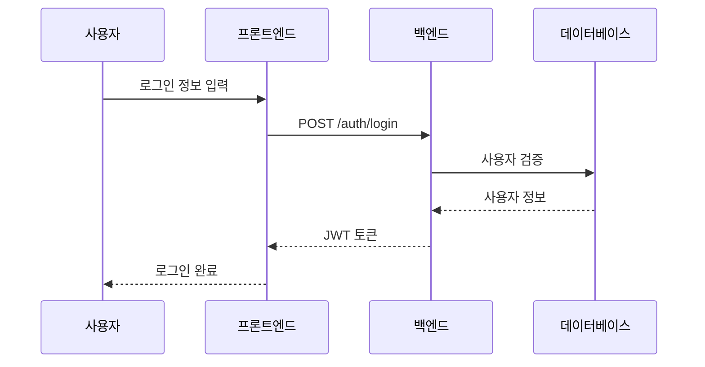
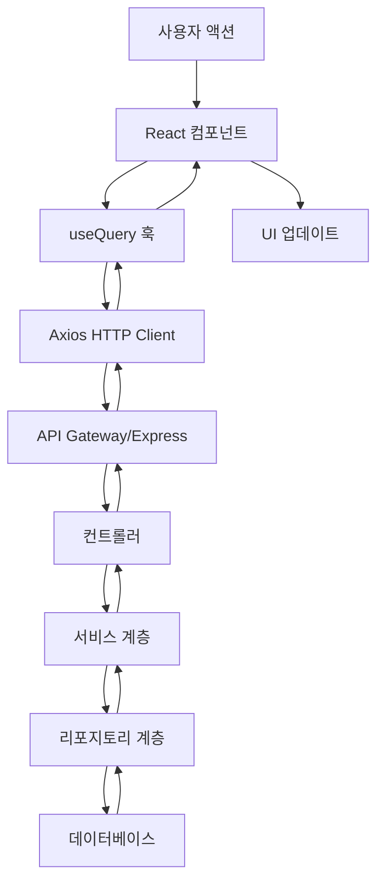
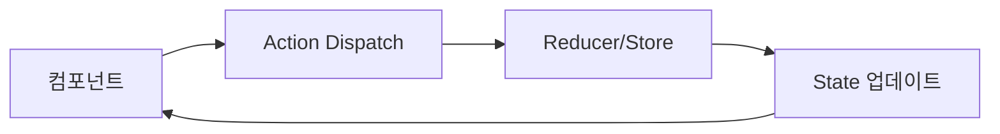
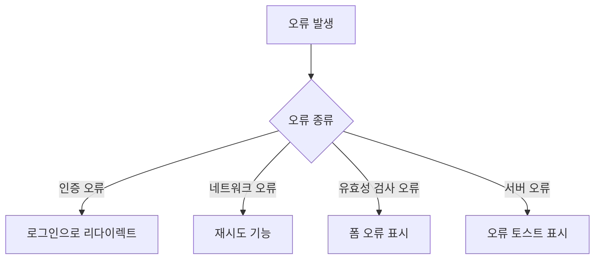
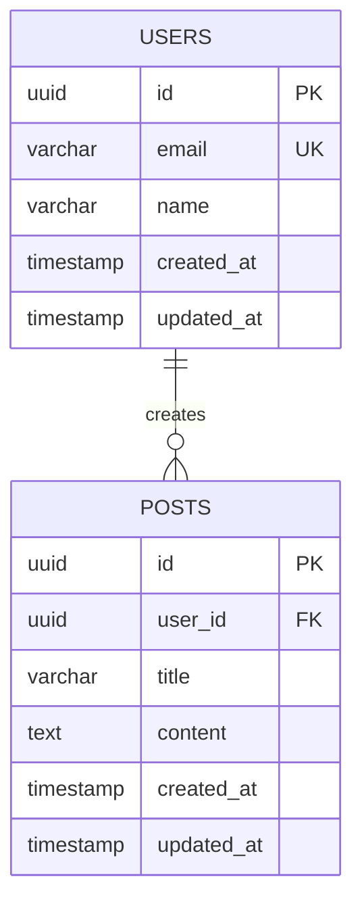

# rev-design

## 목적

기존 코드베이스로부터 기술 설계 문서를 역생성합니다. 구현된 아키텍처, 데이터 흐름, API 사양, 데이터베이스 스키마, TypeScript 인터페이스를 분석하여 설계서로 문서화합니다.

## 전제 조건

- 분석 대상 코드베이스가 존재해야 함
- `docs/reverse/` 디렉토리가 존재해야 함 (없는 경우 생성)
- 가능하면 사전에 `rev-tasks.md`를 실행해 둘 것

## 실행 내용

1. **아키텍처 분석**
   - 프로젝트 구조에서 아키텍처 패턴 식별
   - 레이어 구성 확인 (MVC, Clean Architecture 등)
   - 마이크로서비스 구성 여부
   - 프론트엔드/백엔드 분리 상태

2. **데이터 흐름 추출**
   - 사용자 상호작용 흐름
   - API 호출 흐름
   - 데이터베이스 접근 패턴
   - 상태 관리 흐름

3. **API 사양 추출**
   - 엔드포인트 목록 생성
   - 요청/응답 구조 분석
   - 인증/인가 방식 확인
   - 오류 응답 형식

4. **데이터베이스 스키마 역생성**
   - 테이블 정의 추출
   - 관계성 분석
   - 인덱스 설정 확인
   - 제약 조건 추출

5. **TypeScript 타입 정의 정리**
   - 엔티티 타입 추출
   - API 타입 추출
   - 공통 타입 정리
   - 타입 의존성 분석

6. **컴포넌트 설계 분석**
   - UI 컴포넌트 계층 구조
   - Props 인터페이스
   - 상태 관리 설계
   - 라우팅 설계

7. **파일 생성**
   - `docs/reverse/{프로젝트명}-architecture.md` - 아키텍처 개요
   - `docs/reverse/{프로젝트명}-dataflow.md` - 데이터 흐름도
   - `docs/reverse/{프로젝트명}-api-specs.md` - API 사양
   - `docs/reverse/{프로젝트명}-database.md` - DB 설계
   - `docs/reverse/{프로젝트명}-interfaces.ts` - 타입 정의 모음

## 출력 형식 예시

### architecture.md

```markdown
# {프로젝트명} 아키텍처 설계 (역생성)

## 분석 일시
{실행 일시}

## 시스템 개요

### 구현된 아키텍처
- **패턴**: {식별된 아키텍처 패턴}
- **프레임워크**: {사용 프레임워크}
- **구성**: {발견된 구성}

### 기술 스택

#### 프론트엔드
- **프레임워크**: {React/Vue/Angular 등}
- **상태 관리**: {Redux/Zustand/Pinia 등}
- **UI 라이브러리**: {Material-UI/Ant Design 등}
- **스타일링**: {CSS Modules/styled-components 등}

#### 백엔드
- **프레임워크**: {Express/NestJS/FastAPI 등}
- **인증 방식**: {JWT/Session/OAuth 등}
- **ORM/데이터 접근**: {TypeORM/Prisma/Sequelize 등}
- **유효성 검사**: {Joi/Yup/zod 등}

#### 데이터베이스
- **DBMS**: {PostgreSQL/MySQL/MongoDB 등}
- **캐시**: {Redis/Memcached 등 또는 없음}
- **연결 풀링**: {구현 여부}

#### 인프라 및 도구
- **빌드 도구**: {Webpack/Vite/Rollup 등}
- **테스트 프레임워크**: {Jest/Vitest/Pytest 등}
- **코드 품질**: {ESLint/Prettier/SonarQube 등}

## 레이어 구성

### 발견된 레이어
```
{실제 디렉토리 구조}
```

### 레이어 책임 분석
- **프레젠테이션 계층**: {구현 현황}
- **애플리케이션 계층**: {구현 현황}
- **도메인 계층**: {구현 현황}
- **인프라스트럭처 계층**: {구현 현황}

## 디자인 패턴

### 발견된 패턴
- **Dependency Injection**: {구현 여부}
- **Repository Pattern**: {구현 여부}
- **Factory Pattern**: {사용 위치}
- **Observer Pattern**: {사용 위치}
- **Strategy Pattern**: {사용 위치}

## 비기능 요구사항 구현 현황

### 보안
- **인증**: {구현 방식}
- **인가**: {구현 방식}
- **CORS 설정**: {설정 현황}
- **HTTPS 대응**: {대응 현황}

### 성능
- **캐시**: {구현 현황}
- **데이터베이스 최적화**: {인덱스 등}
- **CDN**: {사용 현황}
- **이미지 최적화**: {구현 현황}

### 운영·모니터링
- **로그 출력**: {구현 현황}
- **오류 추적**: {구현 현황}
- **메트릭 수집**: {구현 현황}
- **헬스 체크**: {구현 현황}
```

### dataflow.md

```markdown
# 데이터 흐름도 (역생성)

## 사용자 상호작용 흐름

### 인증 흐름


### 데이터 조회 흐름


## 상태 관리 흐름

### {사용되고 있는 상태 관리 라이브러리} 흐름


## 오류 처리 흐름


```

### api-specs.md

```markdown
# API 사양서 (역생성)

## 베이스 URL
`{발견된 베이스 URL}`

## 인증 방식
{발견된 인증 방식의 상세}

## 엔드포인트 목록

### 인증 관련

#### POST /auth/login
**설명**: 사용자 로그인

**요청**:
```typescript
{
  email: string;
  password: string;
}
```

**응답**:
```typescript
{
  success: boolean;
  data: {
    token: string;
    user: {
      id: string;
      email: string;
      name: string;
    }
  };
}
```

**오류 응답**:
```typescript
{
  success: false;
  error: {
    code: string;
    message: string;
  }
}
```

#### POST /auth/logout
**설명**: 사용자 로그아웃

**헤더**:
```
Authorization: Bearer {token}
```

### {기타 엔드포인트}

## 오류 코드 목록

| 코드 | 메시지 | 설명 |
|------|--------|------|
| AUTH_001 | Invalid credentials | 인증 정보가 유효하지 않음 |
| AUTH_002 | Token expired | 토큰이 만료됨 |
| VALID_001 | Validation failed | 유효성 검사 오류 |

## 응답 공통 형식

### 성공 응답
```typescript
{
  success: true;
  data: T; // 타입은 endpoint에 따라 변동
}
```

### 오류 응답
```typescript
{
  success: false;
  error: {
    code: string;
    message: string;
    details?: any;
  }
}
```
```

### database.md

```markdown
# 데이터베이스 설계 (역생성)

## 스키마 개요

### 테이블 목록
{발견된 테이블 목록}

### ER도


## 테이블 상세

### users 테이블
```sql
{실제 CREATE TABLE문}
```

**컬럼 설명**:
- `id`: {설명}
- `email`: {설명}
- `name`: {설명}

**인덱스**:
- `idx_users_email`: email 컬럼 검색용

### {기타 테이블}

## 제약·관계성

### 외래 키 제약
{발견된 외래 키 제약}

### 유니크 제약
{발견된 유니크 제약}

## 데이터 접근 패턴

### 자주 사용되는 쿼리
{코드에서 발견된 쿼리 패턴}

### 성능 고려사항
{발견된 인덱스 전략}
```

### interfaces.ts

```typescript
// ======================
// 엔티티 타입 정의
// ======================

export interface User {
  id: string;
  email: string;
  name: string;
  createdAt: Date;
  updatedAt: Date;
}

export interface Post {
  id: string;
  userId: string;
  title: string;
  content: string;
  createdAt: Date;
  updatedAt: Date;
  user?: User;
}

// ======================
// API 타입 정의
// ======================

export interface LoginRequest {
  email: string;
  password: string;
}

export interface LoginResponse {
  success: boolean;
  data: {
    token: string;
    user: User;
  };
}

export interface ApiResponse<T = any> {
  success: boolean;
  data?: T;
  error?: {
    code: string;
    message: string;
    details?: any;
  };
}

// ======================
// 컴포넌트 Props 타입
// ======================

export interface LoginFormProps {
  onSubmit: (data: LoginRequest) => void;
  loading?: boolean;
  error?: string;
}

// ======================
// 상태 관리 타입
// ======================

export interface AuthState {
  user: User | null;
  token: string | null;
  isAuthenticated: boolean;
  loading: boolean;
}

// ======================
// 설정 타입
// ======================

export interface AppConfig {
  apiBaseUrl: string;
  tokenStorageKey: string;
  supportedLanguages: string[];
}
```

## 분석 알고리즘

### 1. 파일 스캔·패턴 매칭
- AST 분석을 통한 함수·클래스·인터페이스 추출
- 정규 표현식을 통한 설정 파일 분석
- 디렉토리 구조에서의 아키텍처 추정

### 2. API 사양의 자동 생성
- Express/NestJS 라우트 정의 분석
- FastAPI 스키마 정의 분석
- TypeScript 타입 정의에서의 요청/응답 추정

### 3. 데이터베이스 스키마 추출
- 마이그레이션 파일 분석
- ORM 모델 정의 분석
- SQL 파일 분석

## 실행 명령어 예시

```bash
# 전체 분석 (모든 설계서 생성)
claude code rev-design

# 특정 설계서만 생성
claude code rev-design --target architecture
claude code rev-design --target api
claude code rev-design --target database

# 특정 디렉토리 분석
claude code rev-design --path ./backend

# 출력 형식 지정
claude code rev-design --format markdown,openapi
```

## 실행 후 확인

- 생성된 설계서 파일 목록 표시
- 추출된 API 수, 테이블 수, 타입 정의 수 등의 통계 정보 표시
- 부족한 설계 요소나 권장 개선점 제시
- 다음 리버스 엔지니어링 단계 (요구사항 정의 생성 등) 제안
