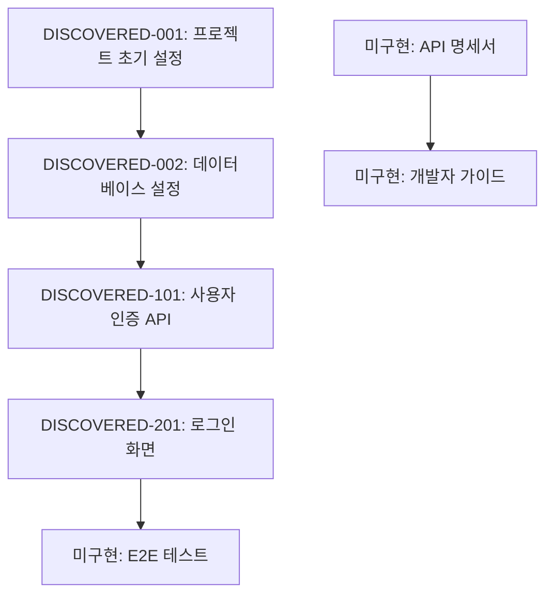

# rev-tasks

## 목적

기존 코드베이스를 분석하여 구현된 기능을 특정하고 태스크 목록으로 정리합니다. 구현된 기능으로부터 역산하여 태스크의 구조, 의존 관계, 구현 상세를 추출하고 문서화합니다.

## 전제 조건

- 분석 대상 코드베이스가 존재해야 함
- `docs/reverse/` 디렉토리가 존재해야 함 (없는 경우 생성)
- TypeScript/JavaScript, Python, 기타 코드를 분석 가능

## 실행 내용

1. **코드베이스의 구조 분석**
   - 디렉토리 구조의 파악
   - 설정 파일의 확인 (package.json, tsconfig.json, requirements.txt 등)
   - 의존 관계의 분석

2. **기능 컴포넌트의 특정**
   - 프론트엔드 컴포넌트
   - 백엔드 서비스/컨트롤러
   - 데이터베이스 관련 (모델, 마이그레이션)
   - 유틸리티 함수
   - 미들웨어

3. **API 엔드포인트의 추출**
   - REST API 엔드포인트
   - GraphQL 리졸버
   - WebSocket 핸들러
   - 라우팅 정의

4. **데이터베이스 구조의 분석**
   - 테이블 정의
   - 릴레이션십
   - 마이그레이션 파일
   - 인덱스 설정

5. **UI/UX 구현의 분석**
   - 화면 컴포넌트
   - 상태 관리의 구현
   - 라우팅
   - 스타일링 기법

6. **테스트 구현의 확인**
   - 단위 테스트의 존재
   - 통합 테스트의 존재
   - E2E 테스트의 존재
   - 테스트 커버리지

7. **태스크의 역산과 정리**
   - 구현된 기능을 태스크로 분해
   - 태스크 ID의 자동 할당
   - 의존 관계의 추정
   - 구현 공수의 추정

8. **파일의 생성**
   - `docs/reverse/{프로젝트명}-discovered-tasks.md`로 저장
   - 발견된 태스크를 구조화하여 문서화

## 출력 형식 예시

```markdown
# {프로젝트명} 발견 태스크 목록

## 개요

**분석 일시**: {분석 실행 일시}
**대상 코드베이스**: {경로}
**발견 태스크 수**: {수}
**추정 총 공수**: {시간}

## 코드베이스 구조

### 프로젝트 정보
- **프레임워크**: {사용 프레임워크}
- **언어**: {사용 언어}
- **데이터베이스**: {사용 DB}
- **주요 라이브러리**: {주요한 의존 관계}

### 디렉토리 구조
```
{디렉토리 트리}
```

## 발견된 태스크

### 기반·설정 태스크

#### DISCOVERED-001: 프로젝트 초기 설정

- [x] **태스크 완료** (구현됨)
- **태스크 타입**: DIRECT
- **구현 파일**: 
  - `package.json`
  - `tsconfig.json`
  - `.env.example`
- **구현 상세**:
  - {발견된 설정 내용}
- **추정 공수**: {시간}

#### DISCOVERED-002: 데이터베이스 설정

- [x] **태스크 완료** (구현됨)
- **태스크 타입**: DIRECT
- **구현 파일**: 
  - `src/database/connection.ts`
  - `migrations/001_initial.sql`
- **구현 상세**:
  - {발견된 DB 설정 내용}
- **추정 공수**: {시간}

### API 구현 태스크

#### DISCOVERED-101: 사용자 인증 API

- [x] **태스크 완료** (구현됨)
- **태스크 타입**: TDD
- **구현 파일**: 
  - `src/auth/auth.controller.ts`
  - `src/auth/auth.service.ts`
  - `src/auth/jwt.strategy.ts`
- **구현 상세**:
  - 로그인/로그아웃 기능
  - JWT 토큰 발행
  - 인증 미들웨어
- **API 엔드포인트**:
  - `POST /auth/login`
  - `POST /auth/logout`
  - `POST /auth/refresh`
- **테스트 구현 상황**:
  - [x] 단위 테스트: `auth.service.spec.ts`
  - [x] 통합 테스트: `auth.controller.spec.ts`
  - [ ] E2E 테스트: 미구현
- **추정 공수**: {시간}

### UI 구현 태스크

#### DISCOVERED-201: 로그인 화면

- [x] **태스크 완료** (구현됨)
- **태스크 타입**: TDD
- **구현 파일**: 
  - `src/components/Login/LoginForm.tsx`
  - `src/components/Login/LoginForm.module.css`
  - `src/hooks/useAuth.ts`
- **구현 상세**:
  - 로그인 폼
  - 유효성 검사 기능
  - 오류 핸들링
- **UI/UX 구현 상황**:
  - [x] 반응형 디자인
  - [x] 로딩 상태
  - [x] 오류 표시
  - [ ] 접근성: 부분적 구현
- **테스트 구현 상황**:
  - [x] 컴포넌트 테스트: `LoginForm.test.tsx`
  - [ ] E2E 테스트: 미구현
- **추정 공수**: {시간}

## 미구현·개선 권장사항

### 부족한 테스트

- [ ] **E2E 테스트 스위트**: 주요 사용자 플로우의 테스트
- [ ] **성능 테스트**: API 응답 시간 테스트
- [ ] **보안 테스트**: 인증·인가 테스트

### 코드 품질 개선

- [ ] **TypeScript 타입 안전성**: 일부에서 any 타입의 사용
- [ ] **오류 핸들링**: 통일적인 오류 처리
- [ ] **로그 출력**: 구조화 로그의 구현

### 문서 부족

- [ ] **API 명세서**: OpenAPI/Swagger 미구현
- [ ] **개발자 가이드**: 셋업 절차서
- [ ] **배포 절차서**: 본番 환경 구축 절차

## 의존 관계 맵



## 구현 패턴 분석

### 아키텍처 패턴
- **구현 패턴**: {발견된 패턴}
- **상태 관리**: {사용되고 있는 상태 관리}
- **인증 방식**: {구현되고 있는 인증 방식}

### 코딩 스타일
- **명명 규칙**: {발견된 명명 규칙}
- **파일 구성**: {파일 구성 패턴}
- **오류 핸들링**: {오류 처리 패턴}

## 기술적 부채·개선점

### 성능
- {발견된 성능 과제}

### 보안
- {발견된 보안 과제}

### 유지보수성
- {발견된 유지보수성 과제}

## 권장 다음 스텝

1. **부족 테스트의 구현** - 특히 E2E 테스트 스위트
2. **문서 정비** - API 명세서와 셋업 가이드
3. **코드 품질 개선** - TypeScript 타입 안전성과 오류 핸들링
4. **보안 강화** - 인증·인가의 상세 리뷰

```

## 분석 대상 파일의 자동 검출

### 프론트엔드
- React: `*.tsx`, `*.jsx`, `*.ts`, `*.js`
- Vue: `*.vue`, `*.ts`, `*.js`
- Angular: `*.component.ts`, `*.service.ts`, `*.module.ts`

### 백엔드
- Node.js: `*.ts`, `*.js` (Express, NestJS 등)
- Python: `*.py` (Django, FastAPI 등)
- Java: `*.java` (Spring Boot 등)

### 데이터베이스
- SQL: `*.sql`, `migrations/*`
- ORM: 모델 파일, 설정 파일

### 설정 파일
- `package.json`, `tsconfig.json`, `webpack.config.js`
- `requirements.txt`, `Pipfile`, `pyproject.toml`
- `pom.xml`, `build.gradle`

## 실행 커맨드 예시

```bash
# 현재 디렉토리를 분석
claude code rev-tasks

# 특정 디렉토리를 분석
claude code rev-tasks --path ./backend

# 특정의 기술 스택에 한정해서 분석
claude code rev-tasks --tech react,nodejs

# 상세 분석 (테스트 커버리지 등도 포함)
claude code rev-tasks --detailed

# 출력 형식 지정
claude code rev-tasks --format json
```

## 실행 후 확인

- 발견된 태스크 수와 추정 공수를 표시
- 구현됨/미구현의 기능 목록을 표시
- 기술적 부채·개선 권장사항을 요약 표시
- 다음의 리버스 엔지니어링 스텝 (설계서 생성 등)을 제안
